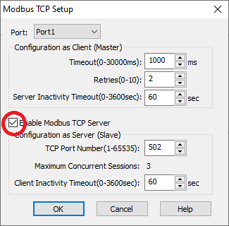
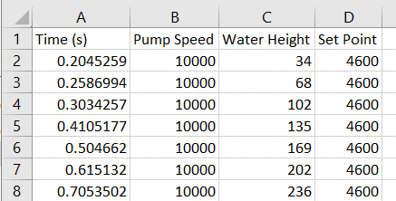

# TankFillModbus
Tank fill simulation that communicates with a PLC via Modbus TCP.

## Installation
```shell
python -m pip install git+https://github.com/blkickli/TankFillModbus
```

## Introduction
This program is for *ENGR 382 SCADA Systems Design* in the *Engineering Department* at the *University of Southern Indiana* and is used by two labs in the course: *On-Off Control* and *PID Control*.

This program has only been tested on a Windows PC and simulates the behavior of a cylindrical tank being filled with water by a variable speed pump. Water continuously drains out of the bottom of the tank. The goal is to control the level of water in the tank to a given set point by varying the flow rate of water entering the top of the tank.

The simulation program communicates with the CLICK PLC via Modbus TCP over an Ethernet link. The simulation program acts as the Modbus client and the PLC acts as the Modbus server. This means that the simulation program initiates all communication. The current water height is sent to the PLC and current desired pump speed is read from the PLC. A control program runs on the PLC to control the level of water in the simulated tank. The mode of control may be discrete (on/off) or continuous (combinations of proportional, integral, and derivative).

## CLICK PLC Control Program
As mentioned above, water height and pump speed are exchanged between the simulation program and the PLC. In addition, the simulation program reads the set point so that it can be stored with the other simulation data. The simulation program expects these values to reside in designated data registers in the PLC. Table 1 defines the data registers and the ranges of values.

Table 1: Variables exchanged between simulation program and PLC, designated data registers with valid ranges of values, and whether the values are read by the PLC or written by the PLC.

| Variable     | Data Register | Modbus Address | Range      | PLC Read/Write |
| :----------: | :-----------: | :------------: | :--------: | :------------: |
| Water Height | DS1           | 0x0000         | 0 to 10000 | Read           |
| Pump Speed   | DS2           | 0x0001         | 0 to 10000 | Write          |
| Set Point    | DS3           | 0x0002         | 0 to 10000 | Write          |

## CLICK PLC Modbus Communication
The CLICK PLC must have the Modbus TCP Server enabled. This should be enabled by default. To verify that it is enabled: Setup -> Modbus TCP (see Figure 1).



Figure 1: Modbus TCP Setup showing that the Modbus TCP Server is enabled.

## Using the Simulation Program
The PC must have Python and this package installed. When this package is installed, a command line script is created to run this program.

### Before Running the Simulation Program
Before running the program, perform the following steps:
1. Connect the trainer to the PC using the USB to Ethernet adapter as usual.
2. Download your control program to the CLICK PLC (if not already downloaded).
3. Download the program to the HMI, if needed.

### Running the Simulation Program
The program has a graphical user interface (GUI) and will also open a console window when run. To run the program, open a command prompt and enter the following command: 
```shell
tankfillmodbus
```
If the trainer is not attached and powered on prior to running the program, the program will display a message ("Not connected") and you must exit the program, connect the trainer, power up the trainer, and run the program again.

While the program is running, it is simulating the tank, capturing data, and communicating with the PLC. The state of the tank is updated by the simulation every 100 ms, data is collected every time the tank state is updated, and the program sends and receives data with the PLC continuously.

Figure 2 shows the GUI for the program.


Figure 2: Tank Fill Modbus graphical user interface (GUI). The program name and version are displayed on the fist line of the messages area followed by the "Connected" message that lists the IP address of the PLC.

**Message Area** — Messages are displayed in the area below the window title.

**Tank Area** - An outline of the tank is shown and the blue area indicates the height of the water in the tank (in Figure 2, the tank is empty).

**Clear Data** — Pressing this button clears the current list of collected data and then resumes collecting data. After the data has been cleared, "Data cleared" is displayed in the message area.

**Save Data** — Pressing this button causes the current list of collected data to be saved to a comma-separated values (CSV) data file in your documents folder (the file path is displayed in the messages area). After saving the data, the list is cleared, data collection resumes, and the path to the file along with the file name is displayed in the message area. CSV files are stored in your documents folder as reported by Windows.

**Save Data & Exit** — Pressing this button saves the collected data to a CSV file and the program exits.

**Exit** — Pressing this button causes the program to exit without saving collected data.

You may clear and save data as often as needed while using the system.

Note that you will have to manually close the console window after exiting from the program.

### Data File
The CSV data file contains data records captured each time the program calculates a new system state each time step. Each data record has the time in seconds since the program started, the pump speed, the water height, and the set point. Microsoft Excel can open CSV files directly. The file is named `simulation data YYmmdd-HHMMSS.csv` where `YYmmdd-HHMMSS` is the current date and time when the file was created. Figure 3 shows an example of a CSV file opened in Microsoft Excel.



Figure 3: Example of a CSV data file opened in Microsoft Excel.

## Errors
If the program shows errors in the console window, send them to your instructor.

You may see one or more “Reconnecting” messages in the message area of the program. The system will continue normally even if it must reconnect.
